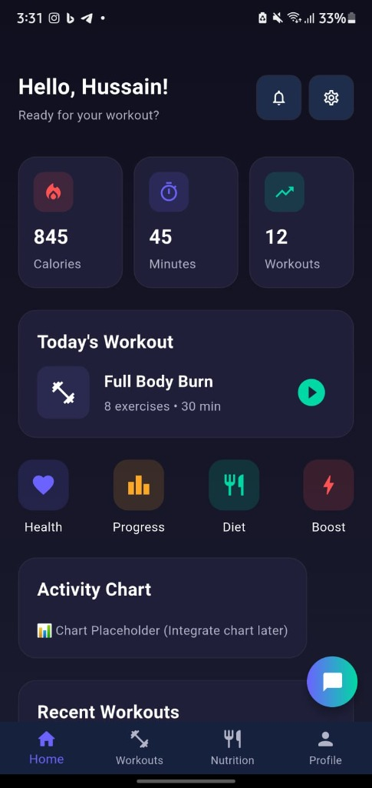
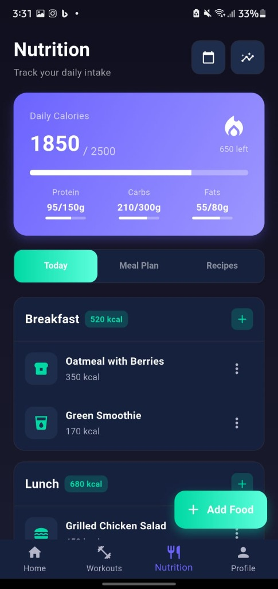
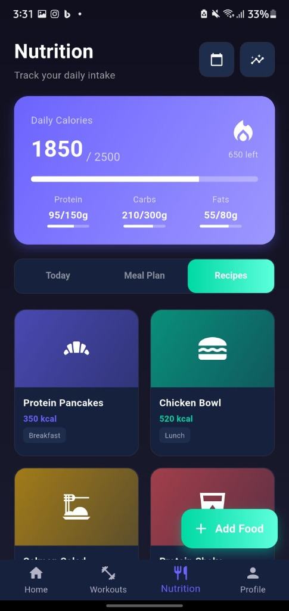
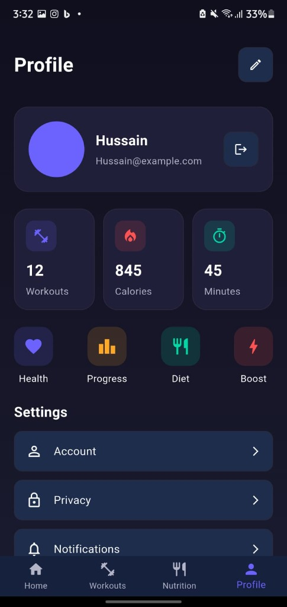

# 🏋️ AI Personal Fitness Coach

> An intelligent Flutter-based fitness application with AI-powered coaching, workout tracking, nutrition management, and real-time pose detection.
---
## 📋 Table of Contents

- [Features](#-features)
- [Screenshots](#-screenshots)
- [Architecture](#-architecture)
- [Getting Started](#-getting-started)
- [Project Structure](#-project-structure)
- [Dependencies](#-dependencies)
- [Roadmap](#-roadmap)
- [Contributing](#-contributing)

---

## ✨ Features

### 🔐 Authentication
- **Email/Password Login** - Secure user authentication
- **Social Login** - Google, Apple, and Facebook integration (UI ready)
- **Sign Up** - User registration with validation
- **Remember Me** - Persistent login sessions

### 🏠 Home Dashboard
- **Activity Overview** - Daily calories, workout time, and progress
- **Today's Workout** - Quick access to scheduled exercises
- **Quick Actions** - Health, Progress, Diet, and Boost shortcuts
- **Activity Charts** - Visual progress tracking (placeholder)
- **Recent Workouts** - History of completed sessions

### 💪 Workout Management
- **Workout Library** - Pre-built workout plans
- **Category Filters** - Strength, Cardio, Flexibility, HIIT
- **Difficulty Levels** - Beginner, Intermediate, Advanced
- **Custom Workouts** - Create personalized training plans
- **AI Training** - Pose detection integration (planned)

### 🍎 Nutrition Tracking
- **Calorie Counter** - Daily intake vs. goals
- **Macro Tracking** - Protein, Carbs, and Fats monitoring
- **Meal Plans** - Pre-designed diet programs
- **Recipe Library** - Healthy meal ideas
- **Food Scanner** - Camera-based food logging (planned)

### 💬 AI Chat Coach
- **Conversational AI** - Get fitness advice and motivation
- **Quick Actions** - Workout plans, meal ideas, progress tips
- **Context-Aware** - Personalized responses based on goals
- **Chat History** - Export and clear conversations

### 👤 Profile & Settings
- **User Profile** - Personal information and stats
- **Progress Stats** - Workouts, calories, and time tracked
- **Settings** - Account, Privacy, Notifications, About

---

## 📱 Screenshots

Experience the sleek, modern UI design of AI Personal Fitness Coach:

````carousel
### 🏠 Home Dashboard

*Track your daily progress with calories, workout time, and quick access to today's workout*

<!-- slide -->

### 💬 AI Chat Coach

*Get personalized fitness advice from your AI coach with quick action buttons*

<!-- slide -->

### 🍎 Nutrition Tracking - Today

*Monitor your daily calorie intake and macros with detailed meal logging*

<!-- slide -->

### 🍽️ Nutrition - Recipes

*Browse healthy recipe ideas categorized by meal type*

<!-- slide -->

### 👤 Profile & Settings

*View your stats and manage account settings*
````

---

## 🏗️ Architecture

### Current Architecture
```
lib/
├── app/
│   ├── core/
│   │   ├── theme/          # App theming (colors, styles)
│   │   └── widgets/        # Reusable custom widgets
│   ├── modules/            # Feature modules
│   │   ├── auth/           # Authentication views
│   │   ├── home/           # Home dashboard
│   │   ├── workout/        # Workout management
│   │   ├── nutrition/      # Nutrition tracking
│   │   ├── chat/           # AI chat interface
│   │   ├── profile/        # User profile
│   │   └── mainNavigationView/  # Bottom navigation
│   └── routes/             # App routing configuration
└── main.dart               # App entry point
```

### Design Patterns
- **GetX** - State management and routing
- **Stateful Widgets** - Local state management
- **Component-Based** - Modular UI components

### Planned Architecture (See Future Improvements)
- **MVVM Pattern** - Separation of concerns
- **Repository Pattern** - Data abstraction
- **Service Layer** - API and business logic
- **Dependency Injection** - GetX bindings

---

## 🚀 Getting Started

### Prerequisites
- **Flutter SDK**: >= 3.9.2
- **Dart SDK**: >= 3.9.2
- **Android Studio** / **VS Code** with Flutter extensions
- **Git**

### Installation

1. **Clone the repository**
   ```bash
   git clone https://github.com/yourusername/ai_personal_fitness_coach.git
   cd ai_personal_fitness_coach
   ```

2. **Install dependencies**
   ```bash
   flutter pub get
   ```

3. **Run the app**
   ```bash
   flutter run
   ```

### Build for Production

**Android**
```bash
flutter build apk --release
```

---

## 📂 Project Structure

```
ai_personal_fitness_coach/
├── android/                 # Android native code
├── ios/                     # iOS native code
├── lib/
│   ├── app/
│   │   ├── core/
│   │   │   ├── theme/
│   │   │   │   ├── app_color.dart      # Color palette
│   │   │   │   └── app_theme.dart      # Theme configuration
│   │   │   └── widgets/
│   │   │       ├── custom_button.dart
│   │   │       ├── custom_gradient_text.dart
│   │   │       ├── custom_socialbtn.dart
│   │   │       ├── custom_textfield.dart
│   │   │       └── loading_widget.dart
│   │   ├── modules/
│   │   │   ├── auth/
│   │   │   │   └── views/
│   │   │   │       ├── login_view.dart
│   │   │   │       └── signup_view.dart
│   │   │   ├── home/
│   │   │   │   └── view/
│   │   │   │       └── home_view.dart
│   │   │   ├── workout/
│   │   │   │   └── view/
│   │   │   │       └── workout_view.dart
│   │   │   ├── nutrition/
│   │   │   │   └── view/
│   │   │   │       └── nutrition_view.dart
│   │   │   ├── chat/
│   │   │   │   └── view/
│   │   │   │       └── chat_view.dart
│   │   │   ├── profile/
│   │   │   │   └── view/
│   │   │   │       └── profile_view.dart
│   │   │   └── mainNavigationView/
│   │   │       └── mainNavigation.dart
│   │   └── routes/
│   │       ├── app_pages.dart          # Route definitions
│   │       └── app_routes.dart         # Route constants
│   └── main.dart                       # App entry point
├── test/                    # Unit and widget tests
├── pubspec.yaml            # Dependencies and assets
└── README.md               # This file
```

---

## 📦 Dependencies

### Core
- **flutter** - UI framework
- **get** (^4.6.6) - State management and routing
- **get_storage** (^2.1.1) - Local storage

### UI & Animations
- **cupertino_icons** (^1.0.6) - iOS-style icons
- **flutter_animate** (^4.5.0) - Animations
- **shimmer** (^3.0.0) - Loading effects
- **lottie** (^3.0.0) - Lottie animations
- **google_fonts** (^6.1.0) - Custom fonts
- **fl_chart** (^0.65.0) - Charts and graphs
- **percent_indicator** (^4.2.3) - Progress indicators
- **cached_network_image** (^3.3.0) - Image caching
- **flutter_svg** (^2.0.9) - SVG support

### Camera & ML (Planned)
- **camera** (^0.10.5+9) - Camera access
- **google_mlkit_pose_detection** (^0.11.0) - Pose detection
- **tflite_flutter** (^0.10.4) - TensorFlow Lite
- **image** (^4.1.3) - Image processing

### Network & API (Planned)
- **http** (^1.1.2) - HTTP requests
- **dio** (^5.4.0) - Advanced HTTP client

### Utils
- **intl** (^0.19.0) - Internationalization
- **permission_handler** (^11.1.0) - Permissions
- **shared_preferences** (^2.2.2) - Persistent storage

---

## 🗺️ Roadmap

### Phase 1: Foundation ✅
- [x] UI/UX Design
- [x] Authentication screens
- [x] Home dashboard
- [x] Workout library
- [x] Nutrition tracking
- [x] AI chat interface
- [x] Profile management

### Phase 2: Backend Integration 🚧
- [ ] REST API integration
- [ ] User authentication backend
- [ ] Workout data synchronization
- [ ] Nutrition database integration
- [ ] Cloud storage for user data

### Phase 3: ML Features 📋
- [ ] Pose detection for exercise form
- [ ] Food recognition from camera
- [ ] Personalized workout recommendations
- [ ] AI-powered meal planning
- [ ] Progress prediction models

### Phase 4: Advanced Features 📋
- [ ] Social features (friends, challenges)
- [ ] Wearable device integration
- [ ] Video workout tutorials
- [ ] Live coaching sessions
- [ ] Gamification and achievements

---

## 🤝 Contributing

Contributions are welcome! Please follow these steps:

1. Fork the repository
2. Create a feature branch (`git checkout -b feature/AmazingFeature`)
3. Commit your changes (`git commit -m 'Add some AmazingFeature'`)
4. Push to the branch (`git push origin feature/AmazingFeature`)
5. Open a Pull Request

---

## 👨‍💻 Author

**Your Name**
- GitHub: [@Hussyn1](https://github.com/Hussyn1)
---

<p align="center">Made with ❤️ and Flutter</p>
